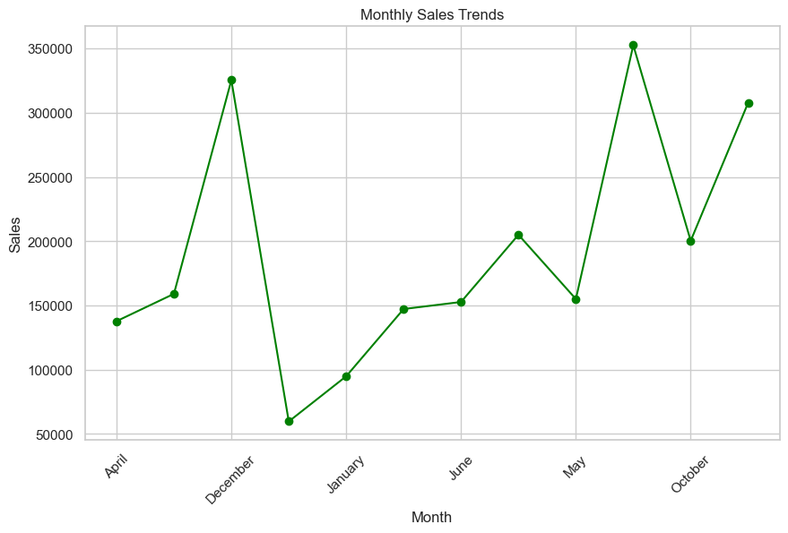
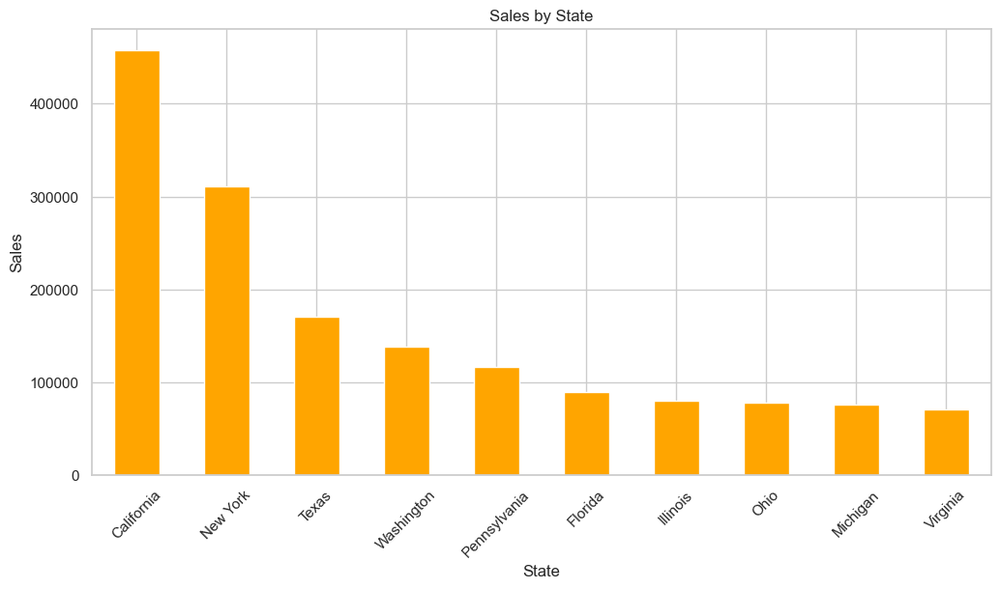
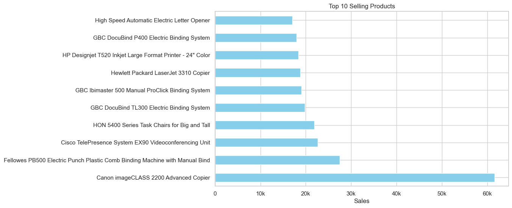
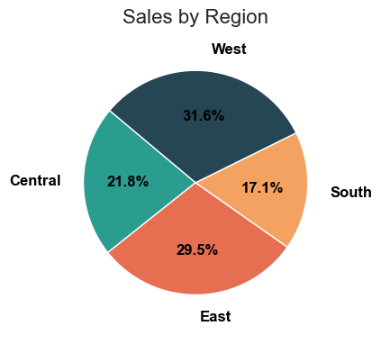

# E-Commerce Sales Analysis (Python Project)

This project provides a complete analysis of store sales using Python.  
It includes data cleaning, preprocessing, exploratory data analysis (EDA), visualizations, insights, and final conclusions.

---

## 📌 Project Overview

This project aims to understand sales performance, customer behavior, and product demand by analyzing an e-commerce dataset.  
The notebook includes step-by-step explanations and clean visual outputs.

---

## 📁 Project Structure (Explanation Included)

### 1. **Data Importing**
Loads the CSV dataset using `pandas` and displays the first rows to understand the data structure.

### 2. **Data Cleaning**
Includes handling:
- Missing values  
- Incorrect data types  
- Duplicate rows  
- Outliers (if needed)

This ensures the dataset becomes clean and ready for analysis.

### 3. **Feature Engineering**
Creates new useful columns such as:
- Profit
- Month name
- Year
- Category grouping
- Customer segmentation

These features improve the accuracy of the analysis.

### 4. **Exploratory Data Analysis (EDA)**
Visual insights created using:
- `matplotlib`
- `seaborn`

Includes:
- Sales distribution  
- Sales by month  
- Top states by revenue  
- Best-selling products  
- Profit by sub-category  

Each visualization has a clear business explanation.

### 5. **Top Insights**
A summary of the most important findings:
- Best states for sales  
- Most profitable sub-categories  
- Best-selling products  
- Months with highest sales  

These findings help business decision‑making.

### 6. **Conclusion**
The final part explains what the business should do to improve performance based on the insights found.

---

## 📸 Visualizations & Dashboards

Below are the main visual outputs generated during the analysis, each providing clear business insights.

---

### 📊 1. Monthly Sales Trend
**Description:**  
This chart shows the monthly sales performance throughout the year.  
It helps identify the strongest sales months and reveals seasonal patterns in customer purchasing behavior.  
Businesses can use this insight for planning marketing campaigns and inventory.

**Image:**  


---

### 🗺️ 2. Top States by Revenue
**Description:**  
Highlights the states generating the highest revenue.  
This visualization helps identify strong geographical markets and potential areas for expansion or targeted marketing.

**Image:**  


---

### 🛒 3. Top 10 Best-Selling Products
**Description:**  
Displays the most frequently purchased products.  
These insights allow businesses to understand customer preferences, optimize stock, and create bundles around best sellers.

**Image:**  


---

### 🌍 4. Sales by Region
**Description:**  
This visualization breaks down total sales across different regions.  
It helps identify which regions have the strongest customer demand and which areas may need improved marketing, logistics, or promotions.  
Understanding regional performance is essential for strategic expansion and resource allocation.

**Image:**  


---

---

## 📦 Requirements

```bash
pandas
matplotlib
seaborn
numpy
```

Install using:

```bash
pip install -r requirements.txt
```

---

## 🚀 How to Run

1. Download the notebook:
```
store_analysis.ipynb
```
2. Upload it to Google Colab **or** open in Jupyter Notebook.
3. Run all cells sequentially.

---

## 🧠 Author

- **Mouaz Nakaweh**  
Data Analyst — Python, Power BI, SQL, Tableau

---

## ⭐ Support the Project

If you like this project:
- Star ⭐ the repository on GitHub  
- Fork it  
- Share it  
